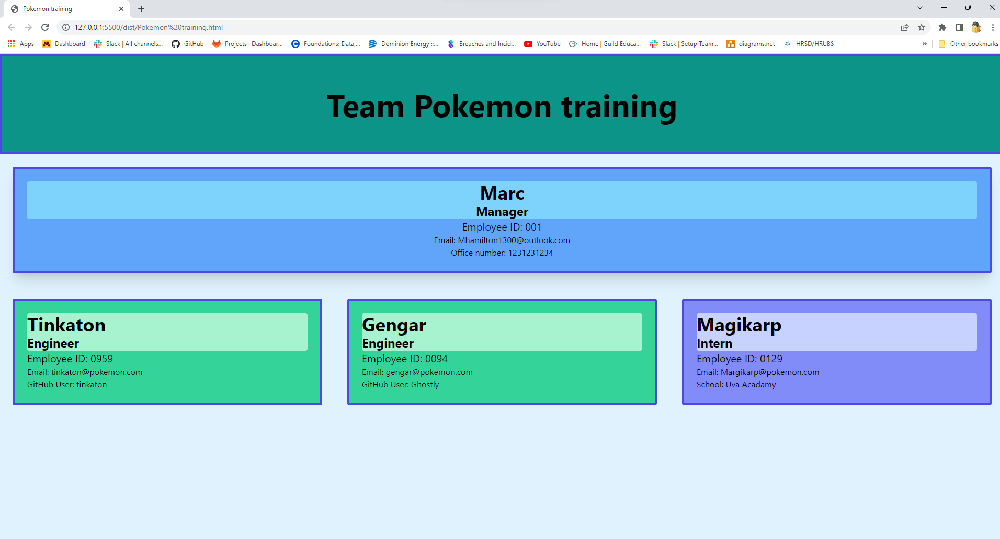

# Coding Badges

# My_Team_Your_Team

# Description
If you ever find yourself getting team all mixed up this application might be able to help you. this application is made to help you keep track of your team by asking you a series of questions, which you will need to answer which will then help generate a html file for you to be able to look at your team in an easier to understand format. 

## Requirements
1. Download this repo
3. Open the folder within Visual Studio Code
4. Open a command prompt inside of Visual Studio Code and enter in `npm i` or `npm install`.
5. Within the same command prompt, enter in `node index.js` and wait for it to run.
6. It will proceed to ask you a list of questions that you will need to answer for your team.

6. Once you've answered all of the questions, you'll find a HTML file created from your answers within the `dist` folder.
7. When you run the file it will have your styled html file. 

# Demo
Here is a link to me doing a demo of using the application
[label](assets/recording/Team_HTML_Demo.webm)

## License
Please refer to the license in the github repo.